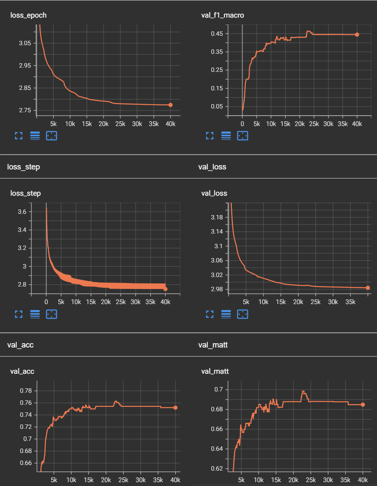

# automl

I have trained 5 models in the automl setting. 
They are arranged from the worst to the best. 
The final decisions were made based on the underlined validation metrics: 

keras_automl keyword matrix classifier -- acc: <ins>0.685</ins> 
keras_automl text classifier -- acc: <ins>0.731</ins> 
sklearn_automl keyword matrix classifier acc criterion -- acc: 0.741,  f1_macro: <ins>0.388</ins>, matthew_corr: 0.673 
sklearn_automl keyword matrix classifier f1_macro criterion  -- acc: 0.724, f1_macro: <ins>0.461</ins>, matthew_corr: 0.651 
sklearn_automl text classifier f1_macro criterion  -- acc: 0.776, f1_macro: 0.457, matthew_corr: <ins>0.722</ins> 

Also, I trained a perceptron on the keyword matrix: 
pytorch lightning keyword matrix classifier -- acc: 0.763, f1_macro: 0.463, matthew_corr: 0.699 
and fine-tuned the bert-base-uncased model 
pytorch lightning bert text classifier head -- acc: 0.492, f1_macro: 0.134, matthew_corr: 0.311 

The perceptron curves:

